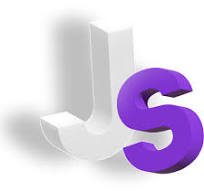

# Заголовок 1
## Заголовок 2
### Заголовок 3

1. Пункт
* да
* нет
* да
2. Пункт

***
___
`I love Javascript.`  
*Jld*;  
**lds;fkls**.  
***flllsdkslkslfkdlfkldfk***.
```
язык Javascript является самым распространенным.
a + b = c;
b - c = a;
```
`язык Javascript является самым распространенным.`

> какая-то цитата

***
Заголовок 1   | Заголовок 2 | Заголовок 3 
:------------ |:-----------:| -----------:
computer      | 1500        | 2
phone         | 1000        | 4
